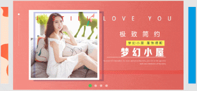
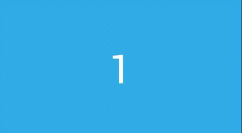

<!--# 今年最后一天Banner全新升级，祝大家新年快乐-->
<!---->

## Banner 2.0 全新升级
> 只做一个可以自定义的轮播容器，不侵入UI ———— Banner 2.0

<a href="https://github.com/youth5201314/banner/tree/release-1.4.10" target="_blank">Banner 1.4.10(还想看老版本的可以点击这里)</a>

### 阔别已久，从新回归
> 很长一段时间没有维护这个项目了，有很多人发邮件反馈，有好的，也有让人无语气氛的；特别是2017经常收到各种谩骂的邮件，所以我只能停止更新关闭邮件提醒。
但是隔了这么长时间看突然发现有这么多人使用，又反馈了很多问题和意见，本着有始有终我决定重新开始重构下，能更好的解决大家的需求：

* 首先我声明几点：
    * 这只是一个开源库，如果满意你可以使用、可以借鉴修改，希望对你们有所帮助。
    * 如果不满意请友好的提出，注明错误的详细信息或者修改建议，亦可以直接提交，我会考虑合并。
    * 如果你觉得实在是没用，也请你做一个有自我修养的人。
   
### 主要改进功能介绍
最开始是想上传以前基于viewpager更新好的版本，但是看着viewpager2正式版已经出来了，就上新的吧，
确实viewpager2确实比viewpager性能好很多，就是目前还没有找到合适方法来控制滑动切换的速度。

- [x] 使用了ViewPager2为基础控件  <a href="https://developer.android.google.cn/jetpack/androidx/releases/viewpager2" target="_blank">[ViewPager2介绍]</a>
- [x] 支持了androidx兼容包
- [x] 方便了UI、Indicator自定义
- [x] 支持画廊效果
- [x] 兼容了水平和垂直轮播，也可以实现类型淘宝头条的效果
- [x] 依赖包目前只需要导入了ViewPager2


### 效果图
更多效果运行demo查看





##### 内置了官方提供的2种PageTransformer效果




## 方法
|方法名|返回类型|描述|
|---|---|---|
|getAdapter()|extends BannerAdapter|获取你设置的BannerAdapter
|getViewPager2()|ViewPager2|获取ViewPager2
|getIndicator()|Indicator|获取你设置的指示器（没有设置直接获取会抛异常哦）
|getIndicatorConfig()|IndicatorConfig|获取你设置的指示器配置信息（没有设置直接获取会抛异常哦）
|getRealCount()|int|返回banner真实总数
|setUserInputEnabled(boolean)|this|禁止手动滑动Banner;true 允许，false 禁止
|setDatas(List<T>)|this|重新设置banner数据
|isAutoLoop(boolean)|this|是否允许自动轮播
|setDelayTime(long)|this|设置轮播间隔时间（默认3000毫秒）
|setScrollTime(long)|this|设置轮播滑动的时间（默认800毫秒）
|start()|this|开始轮播(主要配合生命周期使用)，或者你手动暂停再次启动
|stop()|this|停止轮播(主要配合生命周期使用)，或者你需要手动暂停
|setAdapter(T extends BannerAdapter)|this|设置banner的适配器
|setOrientation(@Orientation)|this|设置banner轮播方向(垂直or水平)
|setOnBannerListener(this)|this|设置点击事件，下标是从0开始
|addOnPageChangeListener(this)|this|添加viewpager2的滑动监听
|setPageTransformer(PageTransformer)|this|设置viewpager的切换效果
|addPageTransformer(PageTransformer)|this|添加viewpager的切换效果（可以设置多个）
|setIndicator(Indicator)|this|设置banner轮播指示器(提供有base和接口，可以自定义)
|setIndicator(Indicator,boolean)|this|设置指示器（传false代表不将指示器添加到banner上，配合布局文件，可以自我发挥）
|setIndicatorSelectedColor(@ColorInt)|this|设置指示器选中颜色
|setIndicatorSelectedColorRes(@ColorRes)|this|设置指示器选中颜色
|setIndicatorNormalColor(@ColorInt)|this|设置指示器默认颜色
|setIndicatorNormalColorRes(@ColorRes)|this|设置指示器默认颜色
|setIndicatorGravity(@IndicatorConfig.Direction)|this|设置指示器位置（左，中，右）
|setIndicatorSpace(int)|this|设置指示器之间的间距
|setIndicatorMargins(IndicatorConfig.Margins)|this|设置指示器的Margins
|setIndicatorWidth(int,int)|this|设置指示器选中和未选中的宽度，直接影响绘制指示器的大小
|setIndicatorNormalWidth(int)|this|设置指示器未选中的宽度
|setIndicatorSelectedWidth(int)|this|设置指示器选中的宽度
|setIndicatorRadius(int)|this|设置指示器圆角，不要圆角可以设置为0
|setIndicatorHeight(int)|this|设置指示器高度
|setBannerRound(float)|this|设置banner圆角（还有一种setBannerRound2方法，需要5.0以上）
|setBannerGalleryEffect(int,int,float)|this|画廊效果(可设置间距缩放)
|setStartPosition(int)|this|设置开始的位置 (需要在setAdapter或者setDatas之前调用才有效哦)

## Attributes属性
>在banner布局文件中调用,如果你自定义了indicator请做好兼容处理。
下面的属性并不是每个指示器都用得到，所以使用时要注意！

|Attributes|format|describe
|---|---|---|
|delay_time|integer|轮播间隔时间，默认3000
|is_auto_loop|boolean|是否自动轮播，默认true
|is_infinite_loop|boolean|是否支持无限循环（即首尾直接过渡），默认true
|banner_orientation|enum|轮播方向：horizontal（默认） or vertical
|indicator_normal_width|dimension|指示器默认的宽度，默认5dp （对RoundLinesIndicator无效）
|indicator_selected_width|dimension|指示器选中的宽度，默认7dp （对RectangleIndicator无效）
|indicator_normal_color|color|指示器默认颜色，默认0x88ffffff
|indicator_selected_color|color|指示器选中颜色，默认0x88000000
|indicator_space|dimension|指示器之间的间距，默认5dp （对RoundLinesIndicator无效）
|indicator_gravity|dimension|指示器位置，默认center
|indicator_margin|dimension|指示器的margin,默认5dp，不能和下面的同时使用
|indicator_marginLeft|dimension|指示器左边的margin
|indicator_marginTop|dimension|指示器上边的margin
|indicator_marginRight|dimension|指示器右边的margin
|indicator_marginBottom|dimension|指示器下边的margin
|indicator_height|dimension|指示器高度（对CircleIndicator无效）
|indicator_radius|dimension|指示器圆角（对CircleIndicator无效）


## 使用步骤
>以下提供的是最简单的步骤，需要复杂的样式自己可以自定义

#### Step 1.依赖banner
Gradle 
```groovy
dependencies{
    compile 'com.youth.banner:banner:2.0.6'  
}
```

#### Step 2.添加权限到你的 AndroidManifest.xml
```xml
<!-- if you want to load images from the internet -->
<uses-permission android:name="android.permission.INTERNET" /> 

```

#### Step 3.在布局文件中添加Banner，可以设置自定义属性
！！！此步骤可以省略，可以直接在Activity或者Fragment中new Banner();
```xml
<com.youth.banner.Banner
    xmlns:app="http://schemas.android.com/apk/res-auto"
    android:id="@+id/banner"
    android:layout_width="match_parent"
    android:layout_height="高度自己设置" />
```

#### Step 4.继承BannerAdapter，和RecyclerView的Adapter一样
```java

/**
 * 自定义布局，下面是常见的图片样式，更多实现可以看demo，可以自己随意发挥
 */
public class ImageAdapter extends BannerAdapter<DataBean, ImageAdapter.BannerViewHolder> {

    public ImageAdapter(List<DataBean> mDatas) {
        //设置数据，也可以调用banner提供的方法,或者自己在adapter中实现
        super(mDatas);
    }

    //创建ViewHolder，可以用viewType这个字段来区分不同的ViewHolder
    @Override
    public BannerViewHolder onCreateHolder(ViewGroup parent, int viewType) {
        ImageView imageView = new ImageView(parent.getContext());
        //注意，必须设置为match_parent，这个是viewpager2强制要求的
        imageView.setLayoutParams(new ViewGroup.LayoutParams(
                ViewGroup.LayoutParams.MATCH_PARENT,
                ViewGroup.LayoutParams.MATCH_PARENT));
        imageView.setScaleType(ImageView.ScaleType.CENTER_CROP);
        return new BannerViewHolder(imageView);
    }

    @Override
    public void onBindView(BannerViewHolder holder, DataBean data, int position, int size) {
        holder.imageView.setImageResource(data.imageRes);
    }

    class BannerViewHolder extends RecyclerView.ViewHolder {
        ImageView imageView;

        public BannerViewHolder(@NonNull ImageView view) {
            super(view);
            this.imageView = view;
        }
    }
}

```

#### Step 5.Banner具体方法调用 

```java
public class BannerActivity extends AppCompatActivity {
    public void useBanner() {
        //--------------------------简单使用-------------------------------
        //创建（new banner()）或者布局文件中获取banner
        Banner banner = (Banner) findViewById(R.id.banner);
        //默认直接设置adapter就行了
        banner.setAdapter(new BannerExampleAdapter(DataBean.getTestData()));
        
        //--------------------------详细使用-------------------------------
        banner.setAdapter(new BannerExampleAdapter(DataBean.getTestData()));
        banner.setIndicator(new CircleIndicator(this));
        banner.setIndicatorSelectedColorRes(R.color.main_color);
        banner.setIndicatorNormalColorRes(R.color.textColor);
        banner.setIndicatorGravity(IndicatorConfig.Direction.LEFT);
        banner.setIndicatorSpace(BannerUtils.dp2px(20));
        banner.setIndicatorMargins(new IndicatorConfig.Margins((int) BannerUtils.dp2px(10)));
        banner.setIndicatorWidth(10,20);
        banner.addItemDecoration(new MarginItemDecoration((int) BannerUtils.dp2px(50)));
        banner.setPageTransformer(new DepthPageTransformer());
        banner.setOnBannerListener(this);
        banner.addOnPageChangeListener(this);
        banner.start();
        //还有更多方法自己使用哦！！！！！！
        
        //-----------------当然如果你想偷下懒也可以这么用--------------------
        //banner所有set方法都支持链式调用(以下列举了一些方法)
        banner.setAdapter(new BannerExampleAdapter(DataBean.getTestData()))
                .setIndicator(new CircleIndicator(this))
                .start();
    }
}
```

## Banner使用中优化体验
**如果你需要考虑更好的体验，可以看看下面的代码**
#### Step 1.（可选）生命周期改变时
```java
public class BannerActivity {
    @Override
    protected void onStart() {
        super.onStart();
        //开始轮播
        banner.start();
    }
    
    @Override
    protected void onStop() {
        super.onStop();
        //结束轮播
        banner.stop();
    }
}
```


## 常见问题（收录被反复询问的问题）

* 网络图片加载不出来？

  `banner本身不提供图片加载功能，首先确认banner本身使用是否正确，具体参考demo，
  然后请检查你的图片加载框架或者网络请求框架，服务端也可能加了https安全认证，是看下是否报有证书相关错误`
  
* 怎么实现视频轮播？

  `demo中有实现类似淘宝商品详情的效果，第一个放视频，后面的放的是图片，并且可以设置首尾不能滑动，可以参考和修改。`

* 我想指定轮播开始的位置？

  `现在提供了setStartPosition()方法，在sheAdapter和setDatas直接调用一次就行了`

* 父控件滑动时，banner切换会获取焦点，然后自动全部显示。不想让banner获取焦点可以给父控件加上：

    ```
        //banner也一定要用最新版哦！
        android:focusable="true"
        android:focusableInTouchMode="true"
    ```
    
## Thanks

- [zguop的控制viewpager2的滑动时间方案](https://github.com/zguop/banner/blob/master/pager2banner/src/main/java/com/to/aboomy/pager2banner/Banner.java)


### 联系方式  <a target="_blank" href="http://mail.qq.com/cgi-bin/qm_share?t=qm_mailme&email=KBkYGhAfGhEYEB5oWVkGS0dF" style="text-decoration:none;"></a>
* 我的个人微博：https://weibo.com/u/3013494003 有兴趣的也可以关注，大家一起交流
* 有问题可以加群大家一起交流，如果你觉得对你有帮助可以扫描下面支付宝二维码随意打赏下哦！

 


## 更新说明
[更新说明](update_message.md)

